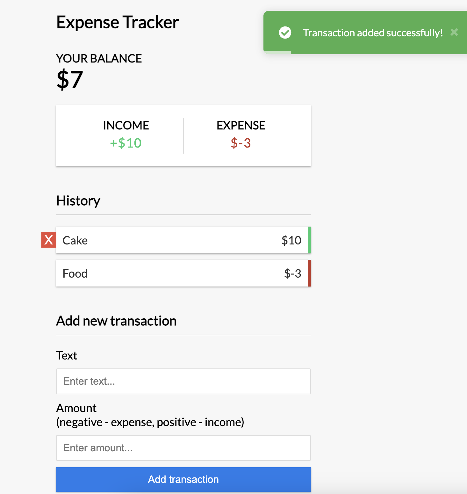

# Vue Expense Tracker

Expense Tracker demo built with Vue Js 3.

Features:

- Balance tracking
- Add and delete expenses and income
- Save transactions to local storage
- Transaction history



## Project Setup

```sh
npm install
```

### Compile and Hot-Reload for Development

```sh
npm run dev
```

### Compile and Minify for Production

```sh
npm run build
```
